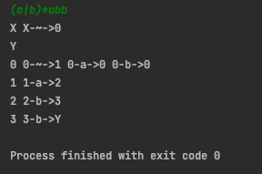
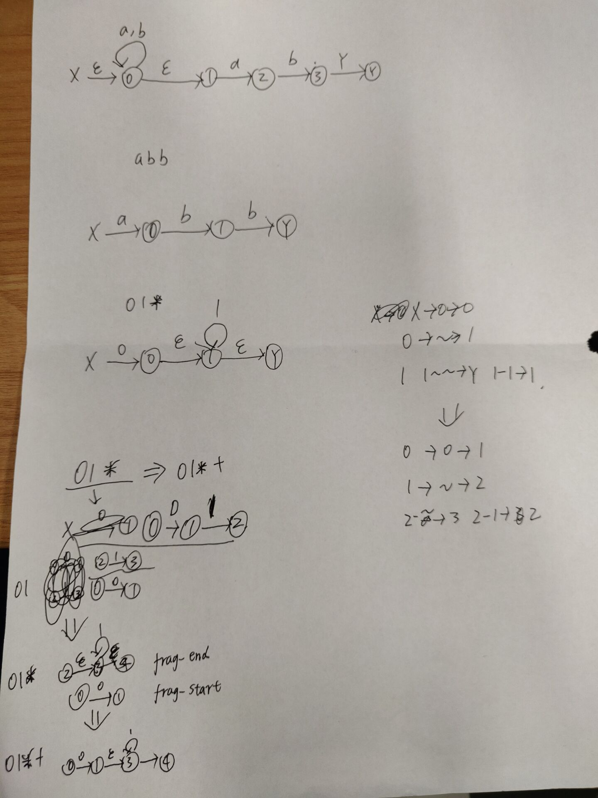

# Compiles-Like-C

这是我的编译器项目，来源于编译原理课程，立下个Flag，最终目标为一个类C语言的编译器

This is my compiler project, derived from the course of compilation principles, and the final goal is a C-like compiler

## Struct 目录结构

- src - 源代码    
-- FrontEnd - 编译器后端    
-- BackEnd - 编译器前端    
- figure - 展示图片
- workplace - 工作区，代码暂时不上传

编译器前端中包括词法分析，目前完成了正则转NFA,文件名为`regex2nfa.cpp`，该文件中的`Regex2Nfa`类可以实现将正则字符转化成NFA结构的描述信息，目前支持的正则字符有`[a-zA-Z0-9]`,`*`,`(`,`)`,`|`。  
`+`字符暂时用于当作分隔符，修饰后的io如下：  

```c++
// 输入  
(a|b)*abb  
// 输出
X X-~->0    
Y
0 0-~->1 0-a->0 0-b->0 
1 1-a->2 
2 2-b->3 
3 3-b->Y
```

## Figures 展示图片

修饰后的输出结果  


正则转nfa中用到的nfa图，目前有缺陷，待修正  


# MIT LECENCE

仅供学习参考用，请勿抄袭